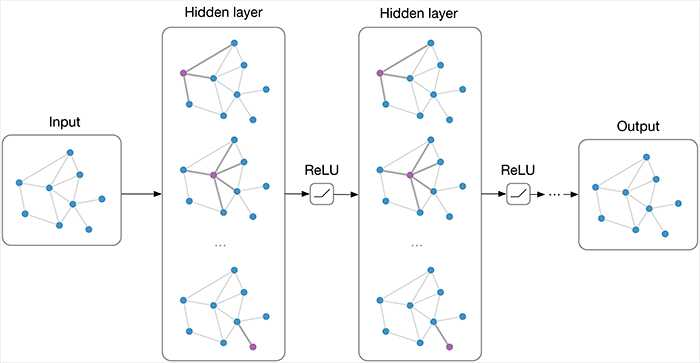

<p align="center">
  <a href="https://github.com/TOMsworkspace/NVGraph">
    
  </a>
  <h3 align="center">NVGraph: A Customizable Hybrid Memory Hardware Simulation Framework for GNNs 
  </h3>
</p>

<p align="center">
    <a href="https://github.com/TOMsworkspace/NVGraph/blob/master/LICENSE">
        
    </a>
    <a href="https://github.com/TOMsworkspace/NVGraph/releases">
        
    </a>
</p>

<!-- ## Update
### March 27th, 2023
We bulid the NVGraph v1.0.  -->

<details open="open">
  <summary>Table of Contents</summary>
  <ol>
    <li><a href="#what-is-nvgraph">What is NVGraph?</a></li>
    <li><a href="#about-the-framework">About the Framework</a></li>
    <li><a href="#prerequisites">Prerequisites</a></li>
    <li><a href="#installation">Installation</a></li>
    <li><a href="#preparing-traces">Preparing Traces</a></li>
    <ul>
      <li><a href="#more-traces">More Traces</a></li>
    </ul>
    <li><a href="#evaluate-simulation">Evaluate Simulation</a></li>
    <li><a href="#citation">Citation</a></li>
    <li><a href="#license">License</a></li>
    <li><a href="#contact">Contact</a></li>
  </ol>
</details>

## What is NVGraph?

> NVGraph is a hardware-realizable, light-weight hybrid memory simulation framework. Base on NVGraph, you can simulate different cache configuration, replacement algorithm, prefetcher on hybrid memory system for GNN application. 


## About The Framework

NVGraph is implemented base on [ChampSim simulator](https://github.com/ChampSim/ChampSim) and [Pythia simulator](https://github.com/CMU-SAFARI/Pythia). We have significantly modified the prefetcher integration pipeline in ChampSim to add support to a wide range of prior prefetching proposals mentioned below:

* Stride [Fu+, MICRO'92]
* Streamer [Chen and Baer, IEEE TC'95]
* SMS [Somogyi+, ISCA'06]
* AMPM [Ishii+, ICS'09]
* Sandbox [Pugsley+, HPCA'14]
* BOP [Michaud, HPCA'16]
* SPP [Kim+, MICRO'16]
* Bingo [Bakshalipour+, HPCA'19]
* SPP+PPF [Bhatia+, ISCA'19]
* DSPatch [Bera+, MICRO'19]
* MLOP [Shakerinava+, DPC-3'19]
* IPCP [Pakalapati+, ISCA'20]
* T2 [Kondguli+, ICCD'17]
* TPC [Kondguli+, ISCA'18]s
* Pythia [Bera+, MICRO'21]

Most of the  prefetchers (e.g., SPP [1], Bingo [2], IPCP [3]) reuse codes from [2nd]() and [3rd]() data prefetching championships (DPC). Others (e.g., AMPM [4], SMS [5]) are implemented from scratch and shows similar relative performance reported by previous works.

We have modified the cache replacement to support to a wide range of prior replacement algorithm proposals mentioned below:

* LRU
* SHIP [Wu+, MICRO'11]
* SRRIP [Chaudhuri+, PACT'12]

What's more, we also modified the memory controller, so NVGraph can run on DRAM-based memory or DRAM-NVM hybrid memory systems.

## Prerequisites

The infrastructure has been tested with the following system configuration:
  * G++ v6.3.0 20170516
  * CMake v3.20.2
  * md5sum v8.26
  * Perl v5.24.1
  * [Megatools 1.11.0](https://megatools.megous.com) (Note that v1.9.98 does **NOT** work)

## Installation

0. Install necessary prequisites
    ```bash
    sudo apt install perl
    ```
1. Clone the GitHub repo
   
   ```bash
   git clone https://github.com/TOMsworkspace/NVGraph.git
   ```
2. Clone the bloomfilter library inside NVGraph home directory
   
   ```bash
   cd NVGraph
   git clone https://github.com/mavam/libbf.git libbf
   ```
3. Build bloomfilter library. This should create the static `libbf.a` library inside `build` directory
   
    ```bash
    cd libbf
    mkdir build && cd build
    cmake ../
    make clean && make
    ```
4. Build NVGraph for single/multi core using build script. This should create the executable inside `bin` directory.
   
   ```bash
   cd $NVGRAPH_HOME
   # ./build_nvgraph.sh <l1_pref> <l2_pref> <llc_pref> <ncores>
   ./build_nvgraph.sh multi multi no 1
   ```
   Please use `build_nvgraph_highcore.sh` to build NVGraph for more than four cores.

5. _Set appropriate environment variables as follows:_

    ```bash
    source setvars.sh
    ```

## Preparing Traces
0. Install the megatools executable

    ```bash
    cd $NVGRAPH_HOME/scripts
    wget https://megatools.megous.com/builds/experimental/megatools-1.11.0-git-20210505-linux-x86_64.tar.gz
    tar -xvf megatools-1.11.0-git-20210505-linux-x86_64.tar.gz
    ```
1. Use the `download_traces.pl` perl script to download necessary ChampSim traces.

    ```bash
    mkdir $NVGRAPH_HOME/traces/
    cd $NVGRAPH_HOME/scripts/
    perl download_traces.pl --csv artifact_traces.csv --dir ../traces/
    ```
> Note: The script should download **233** traces. Please check the final log for any incomplete downloads. The total size of all traces would be **~52 GB**.

2. Once the trace download completes, please verify the checksum as follows. _Please make sure all traces pass the checksum test._

    ```bash
    cd $NVGRAPH_HOME/traces
    md5sum -c ../scripts/artifact_traces.md5
    ```

3. If the traces are downloaded in some other path, please change the full path in `experiments/*.tlist` accordingly.

### More Traces

4. Some common trace. There are some common trace from prior works. These traces can be found in the following links. NVGraph is completely compatible with all prior ChampSim traces used in CRC-2 and DPC-3. One can also convert the CVP-2 traces (courtesy of Qualcomm Datacenter Technologies) to ChampSim format using [the following converter](https://github.com/ChampSim/ChampSim/tree/master/cvp_tracer). The traces can be found in the follwing websites:
     * PARSEC-2.1: https://bit.ly/champsim-parsec2
     * Ligra: https://bit.ly/champsim-ligra
     * CRC-2 traces: http://bit.ly/2t2nkUj
     * DPC-3 traces: http://hpca23.cse.tamu.edu/champsim-traces/speccpu/
     * CVP-2 traces: https://www.microarch.org/cvp1/cvp2/rules.html

5. Build trace from GNNs. We are also build trace from GNNs using the 
[Intel Pinplay](https://software.intel.com/content/www/us/en/develop/articles/program-recordreplay-toolkit.html) and the traces are captured by the NVGraph PINtool(see the NVGraph/tracer/nvgraph_tracer.cpp), which is modified from the ChampSim PINtool().

  * download pin
  ```bash
  wget https://software.intel.com/sites/landingpage/pintool/downloads/pin-3.22-98547-g7a303a835-gcc-linux.tar.gz

  tar -zxvf pin-3.22-98547-g7a303a835-gcc-linux.tar.gz

  ##pin run
  PIN_ROOT/pin [pin options] -t <PINtool> [PINtool options] -- gnn_applicatio [gnn_application options]
  ```

  * build the NVGraph PINtool

  Then set the PIN_ROOT in the NVGraph/tracer/make_tracer.sh and the NVGraph/tracer/clean_tracer.sh.
  ```bash
  cd NVGraph/tracer/
  ./make_tracer.sh
  ```

  The tracer has three options you can set:

  ```bash
  -o
  Specify the output file for your trace.
  The default is default_trace.nvgraph

  -s <number>
  Specify the number of instructions to skip in the program before tracing begins.
  The default value is 0.

  -t <number>
  The number of instructions to trace, after -s instructions have been skipped.
  The default value is 1,000,000.
 ```

  * generate GNN trace

  ```bash
  $PIN_ROOT/pin [pin options] -t obj-intel64/nvgraph_tracer.so [nvgraph options] -- <your gnn application>
  ```
  **Note that:** the GNN appliction should run on CPU.

## Evaluate Simulation

NVGraph measures the IPC (Instruction Per Cycle) value as a performance metric.
There are some other useful metrics printed out at the end of simulation.

There is a example for NVGraph simulation on 4 core cpu with l2 Bingo prefetcher:
```bash
$NVGRAPH_ROOT/bin/nvgraph-multi-multi-no-ship-4core --warmup_instructions=5000000 --simulation_instructions=15000000 --l2c_prefetcher_types=bingo --config=$NVGRAPH_ROOT/config/bingo.ini  -traces $NVGRAPH_ROOT/traces/gcn_trace.xz $NVGRAPH_ROOT/traces/gcn_trace.xz $NVGRAPH_ROOT/traces/gcn_trace.xz $NVGRAPH_ROOT/traces/gcn_trace.xz > gnn_bingo.out 2>&1

```

## Citation
If you use this framework, please cite the following bibtex item:
```

```

## License

Distributed under the MIT License. See `LICENSE` for more information.

## Contact

TOM - TOMsworkspace@gmail.com

